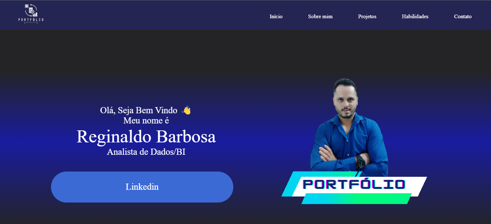

 
 
<h1 align="center">📊Portfólio - Reginaldo Barbosa</h1>

### Tópicos 

- [Descrição](#descrição)

- [Seções](#seções)

- [Resultado](#resultado)

- [Link](#link)

- [Licença](#licença)

- [Autor](#autor)

## 🏷 Descrição 

Portfólio com projetos que desenvolvi ao longo da minha carreira profisional e de estudante.
 
    Alguns projetos estão em desenvolvimento.
 

## 📚 Seções

O site é composto por cinco seções:

- **Home:** Breve apresentação;
- **Sobre mim:** Descrição dizendo um pouco sobre quem sou;
- **Projetos:** Projetos ralizando e em desenvolvimento;
- **Habilidades:** Nessa sesão mostro as ferramentas que possuo conhecimento;
- **Contato:** Contatos;

---

## 💻 Resultado

 
Acessa aqui meu <a href="https://reginaldo-projects.github.io/Portfolio-Reginaldo-Projects/" target="_blank">Portfólio</a>.

 

 
## 🗳 Link
 
 
Confira o <a href="https://reginaldo-projects.github.io/Portfolio-Reginaldo-Projects/" target="_blank">Acessa aqui meu Portfólio</a>.

## 📌 Licença

 ---

## 👍 Autor

<table>
  <tr>
    <td align="center">
      <a href="https://github.com/Reginaldo-projects">
         
        
          <b>Reginaldo Barbosa</b>
        
      </a>
    </td>
  </tr>
</table>

 